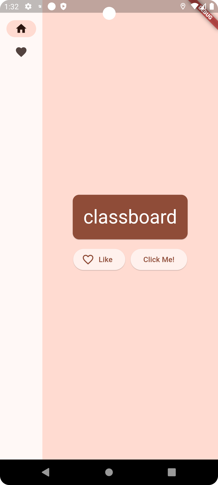

# First Flutter Project

Names App.

## Getting Started

Topics Covered:
1. Basic UI Widgets (Button, ExtendedButton, ExtendedButton with icon, Text, Card).
2. Theme and Text Style.
3. Navigation Rail concept.
4. Stateless and Stateful Widgets.
5. Multi screen navigation.
6. Basic Dart concepts.
7. Third party library integration: english_words: ^4.0.0.

### Screenshots

#### Image 1

#### Image 2

#### Image 3

#### Image 4

